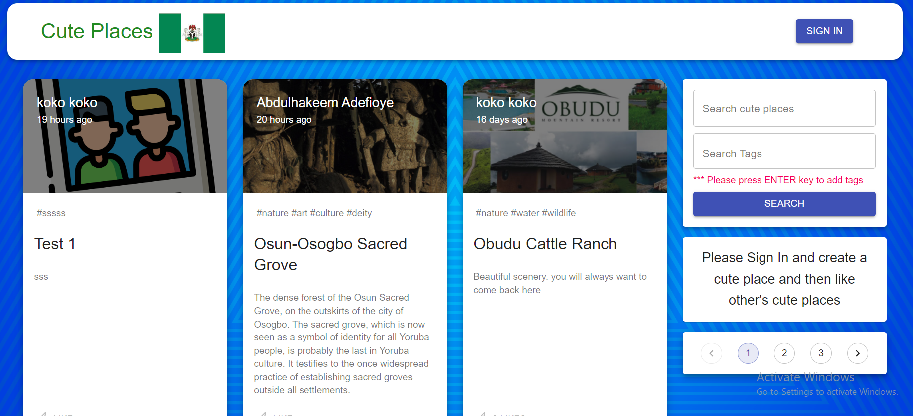

# Cute Places in Nigeria App

`Visit the website on:` **https://radiant-hamlet-16591.herokuapp.com**

- [Outline of project](#cute-places-in-nigeria-app)
  - [1. Project Description](#project-description)
  - [2. Front End Technologies used](#front-end-technologies)
  - [3. Back End Technologies used](#back-end-technologies)
  - [4. Conclusion](#conclusion)

## Project Description

The `Cute Places` App is an application that allows authenticated users to create, edit, delete, comment, like cute places they have created and published. Authenticated users can also like cute places created and published by others.

## Front End Technologies

- React
- Redux
- HTML
- CSS
- Material UI
- Material UI Icons
- React-Redux
- Redux Thunk
- Create-React-App
- Axios
- React-Google-Login
- React-File-Base64

## Back End Technologies

- Node
- Body-parser
- Express
- Mongoose
- JWT Authetication
- Nodemon
- Concurrently

## Conclusion

This project gave me ample opportunity to learn a variety of technolgies. I was able to use React, Redux and Node simaultaneously. It gave me more understanding on how to manage redux store in a relatively complex React App. I was able to use 2 authentication technolgies for users of the app. However, there are still some areas that can be improved upon such as `Adding Real time chat app amongst users`, `Making image uploads more scalable using Cloudinary or S3` and a host of other things.
